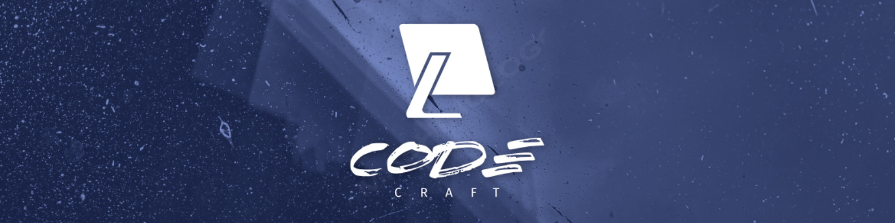

 

<h1 align="center"> < 🌎 Hello World!, Nosso nome é <strong>CodeCraft</strong>  /> </h1>

# CodeCraft

Bem-vindo ao repositório do **CodeCraft**! Somos uma startup da ArtLife Innovation dedicada a compartilhar conhecimento e insights valiosos sobre programação e tecnologia. Nosso principal produto é o CodeCraft Podcast, onde discutimos uma ampla variedade de tópicos relevantes para desenvolvedores e entusiastas de tecnologia.

## Nossos Objetivos

Na CodeCraft, nosso objetivo é fornecer uma plataforma educacional e informativa onde os ouvintes possam aprender, se inspirar e se manter atualizados sobre as tendências e novidades do mundo da programação e tecnologia.

## O Que Fazemos

Nós produzimos episódios regulares do CodeCraft Podcast que abordam:

- Tendências do mercado de tecnologia
- Novas linguagens de programação
- Entrevistas com especialistas da indústria
- Discussões sobre melhores práticas e inovações

## Nossos Valores

- **Educação**: Estamos comprometidos em promover o conhecimento e o aprendizado contínuo na comunidade de desenvolvimento de software.
- **Compartilhamento**: Acreditamos no poder do compartilhamento de conhecimento para impulsionar o crescimento pessoal e profissional.
- **Inovação**: Buscamos constantemente explorar novas ideias e tecnologias para manter nossos ouvintes informados sobre as últimas tendências do setor.

## Como nos Encontrar

Para ouvir nossos episódios e se manter atualizado, visite nosso site:

- **CodeCraft Podcast**: [www.codecraftpodcast.com](http://www.codecraftpodcast.com)

## Contato

Para sugestões de tópicos, feedback ou parcerias, entre em contato conosco:

- **Email**: coddecarft365@gmail.com
- **Telefone**: +(551) 965 855 848
- **Endereço**: Fundão, Castelo Bracno, Portugal

Agradecemos por escolher o CodeCraft Podcast como sua fonte de informações sobre programação e tecnologia. Juntos, vamos explorar o mundo emocionante do desenvolvimento de software!